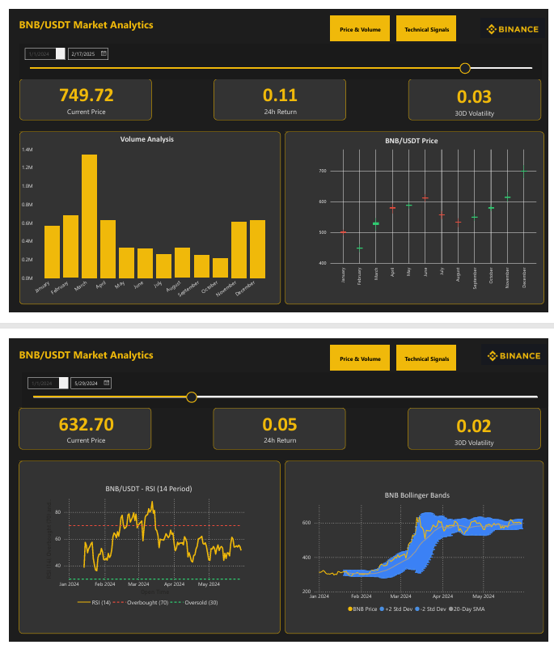

# Binance Coin (BNB) Market Analysis for Trading Insights

**Objective**: This project analyzes historical Binance Coin (BNB) market data (OHLCV) to identify potential trading signals and understand user behavior patterns. The analysis leverages Binance's public API and standard data science techniques, demonstrating skills directly applicable to data analysis roles within the crypto exchange ecosystem, particularly at Binance.

## 🚀 Key Features

* Fetches and processes historical OHLCV data via the official Binance API (`python-binance`).
* Automates data validation and cleaning processes.
* Calculates key technical indicators: VWAP, SMA/EMA, Bollinger Bands, RSI, OBV.
* Models and analyzes market volatility using rolling windows and identifies anomalies.
* Identifies potential market patterns like price-volume divergence.
* Visualizes findings using Python (Matplotlib/Seaborn) and an interactive Power BI dashboard.

## 📊 Interactive Dashboard Preview



link to Dashboard:https://app.powerbi.com/links/KWZ6sjuhCi?ctid=d5cf20c2-4a84-4902-a3e6-c4a3190ea239&pbi_source=linkShare

## 🔍 Methodology

1.  **Data Collection**:
    * Utilized the `python-binance` library to programmatically fetch historical OHLCV (Open, High, Low, Close, Volume) data for BNB trading pairs (e.g., BNB/USDT) from January 2024 to April 2025. *(Adjust date range if different)*
    * Implemented automated scripts for data validation (checking for gaps, outliers) and cleaning (handling missing values via interpolation/forward-fill, ensuring correct data types).

2.  **Feature Engineering & Analysis**:
    * **Technical Indicators**: Calculated using the `ta` library and custom functions:
        * Volume Weighted Average Price (VWAP)
        * Simple Moving Averages (SMA) & Exponential Moving Averages (EMA) over various periods.
        * Bollinger Bands to assess volatility ranges.
        * Relative Strength Index (RSI) for momentum.
        * On-Balance Volume (OBV) to relate price and volume.
    * **Volatility Modeling**: Calculated rolling 30-day price volatility (standard deviation of log returns). Implemented basic anomaly detection to flag periods of unusually high or low volatility compared to the rolling average.

3.  **Visualization**:
    * **Power BI Dashboard**: Developed an interactive dashboard allowing users to filter data by time periods, select different technical indicators, and explore relationships dynamically.
    * **Python Visualizations**: Employed Matplotlib and Seaborn to generate static plots, including correlation heatmaps between indicators and trend decomposition analysis.

## 📈 Key Findings & Potential Applications for Binance

### 1. Price-Volume Divergence (Observed Feb–Mar 2024)
* **Finding**: Analysis revealed instances where significant spikes in trading volume preceded notable price rallies by approximately 24–48 hours, suggesting accumulation before upward movements.
* **Potential Application**: This pattern could potentially inform **liquidity provisioning strategies** or trigger targeted **trading incentive programs** during detected low-volume accumulation phases to enhance market depth.

### 2. Periods Suggesting Reduced Trader Interest (Observed in early 2025)
* **Finding**: Identified periods characterized by declining price trends coupled with stagnant or decreasing volume, potentially indicating reduced trader engagement or caution.
* **Potential Application**: Such patterns could serve as flags for the **marketing or user growth teams** to consider campaigns (e.g., BNB staking promotions, trading fee discounts) aimed at reactivating user interest and trading activity.

### 3. Volatility Clustering & Macroeconomic Correlation
* **Finding**: Observed that periods of high volatility in BNB price tended to cluster and showed correlation with major macroeconomic events or announcements (e.g., regulatory news, Fed rate decisions).
* **Potential Application**: This analysis provides empirical backing for enhancing **risk management models**. Findings could be used to dynamically adjust parameters like margin requirements or liquidation thresholds during anticipated high-volatility periods based on external event calendars.

## 🛠️ Technical Stack

* **Programming Language**: Python 3.x
* **Core Libraries**: `pandas`, `numpy`, `matplotlib`, `seaborn`, `python-binance`, `ta`
* **Data Visualization**: Power BI Desktop, Matplotlib, Seaborn
* **Environment**: Jupyter Notebooks (for exploratory analysis), VS Code (for scripting)
* **API**: Binance Public API

## ⚙️ Setup and Installation

1.  **Clone the repository:**
    ```bash
    git clone [https://github.com/](https://github.com/)[your-username]/[your-repo-name].git
    cd [your-repo-name]
    ```
2.  **Create a virtual environment (recommended):**
    ```bash
    python -m venv venv
    # On Windows
    .\venv\Scripts\activate
    # On macOS/Linux
    source venv/bin/activate
    ```
3.  **Install dependencies:**
    *(Ensure you have a requirements.txt file)*
    ```bash
    pip install -r requirements.txt
    ```

## ▶️ Usage

1.  **Data Fetching/Processing:**
    * Run the data collection script (adjust path/name as needed):
        ```bash
        python scripts/fetch_bnb_data.py
        ```
2.  **Exploratory Analysis:**
    * Open and run the Jupyter Notebook for detailed steps:
        `notebooks/BNB_Market_Analysis.ipynb`
3.  **Interactive Dashboard:**
    * Open the Power BI file using Power BI Desktop:
        `dashboard/BNB_Analysis_Dashboard.pbix`
    *(Make sure the data sources within the Power BI file are correctly linked, possibly using relative paths if data is stored within the repo)*


## 📄 License

This project is licensed under the MIT License - see the [LICENSE](LICENSE) file for details.
